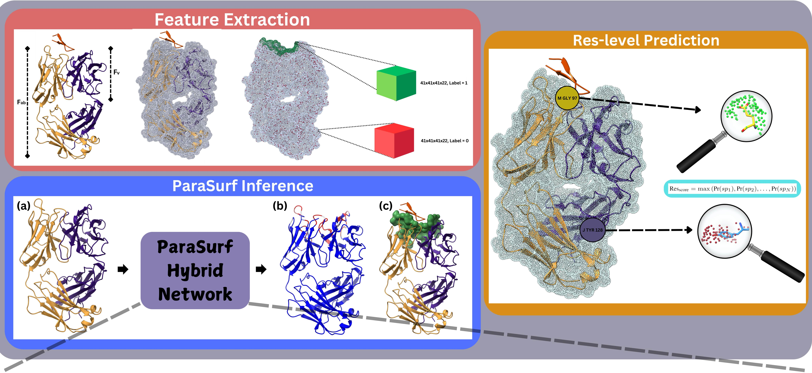

# **ParaSurf**
## **Surface-Based Deep Learning for Paratope-Antigen Interaction Prediction**

ParaSurf is a state-of-the-art surface-based deep learning model for predicting interactions between paratopes and antigens, with outstanding results across three major antibody-antigen benchmarks:

* PECAN 
* Paragraph Expanded
* MIPE


## **ParaSurf Graphical Absract**



## Installation
Install the **DMS software** for the surface molecular representation.
```bash
cd dms
sudo make install
```
Setup the **Environment**
```bash
# Clone ParaSurf repository
git clone https://github.com/aggelos-michael-papadopoulos/ParaSurf.git 

# Create and activate conda environment
conda create -n ParaSurf python=3.9
conda activate ParaSurf
```

Install **ParaSurf**

```bash
# Install PyTorch with CUDA support
conda install pytorch==2.0.0 torchvision==0.15.0 torchaudio==2.0.0 pytorch-cuda=11.7 -c pytorch -c nvidia

# Install additional Python packages
pip install torchsummary scipy tqdm h5py jsonpickle pandas biopython scikit-learn matplotlib wandb

# Install OpenBabel for chemical data processing
conda install -c conda-forge openbabel

# Install specific Numpy version
conda install numpy=1.24
```

Add ParaSurf to PYTHONPATH
```bash
nano ~/.bashrc  
export PYTHONPATH=$PYTHONPATH:/your/path/to/ParaSurf  # change the path to yours
source ~/.bashrc  
```

## **Blind paratope binding site prediction**
Run blind binding-site prediction. Download the best model weights for each training scenario from [here](ParaSurf/model_weights/README.md).

```bash
python blind_predict.py --receptor "test_blind_prediction/4N0Y_receptor_1.pdb" --model_weights "path/to/model_weights"
```

## Create Dataset from scratch
Prepare the dataset from initial .csv files and create ParaSurf features for training.

### 1. Create dataset from the .csv files
For detailed instructions on preparing the dataset, see the [Dataset Preparation README](ParaSurf/create_datasets_from_csv/README.md).

### 2. Feature extraction
Follow instructions for feature extraction in the [ParaSurf Feature Extraction](ParaSurf/preprocess/README.md).

### 3. Train ParaSurf
Train and validate ParaSurf to reproduce the paper's results:
```bash
# Train and validate ParaSurf model
python ParaSurf/train/train.py

# Validate to reproduce paper results
python ParaSurf/train/validation.py
```

# Citation
coming soon ...
