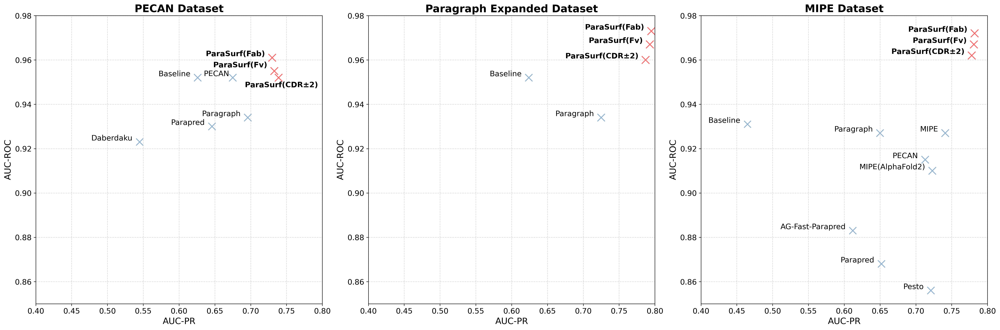

# **ParaSurf**
## **Surface-Based Deep Learning for Paratope-Antigen Interaction Prediction**

ParaSurf is a state-of-the-art surface-based deep learning model for predicting interactions between paratopes and antigens, with outstanding results across three major antibody-antigen benchmarks:

* PECAN 
* Paragraph Expanded
* MIPE




## **ParaSurf Graphical Absract**


## INSTALL
Install the **DMS software** for the surface molecular representation.
```bash
cd dms
sudo make install
```
Setup the **Environment**.
```bash
# Clone ParaSurf repository
git clone https://github.com/aggelos-michael-papadopoulos/ParaSurf.git 

# Create and activate conda environment
conda create -n ParaSurf python=3.9
conda activate ParaSurf
```

Install **ParaSurf**.

```bash
# Install PyTorch with CUDA support
conda install pytorch==2.0.0 torchvision==0.15.0 torchaudio==2.0.0 pytorch-cuda=11.7 -c pytorch -c nvidia

# Install additional Python packages
pip install torchsummary scipy tqdm h5py jsonpickle pandas biopython scikit-learn matplotlib wandb

# Install OpenBabel for chemical data processing
conda install -c conda-forge openbabel

# Install specific Numpy version
conda install numpy=1.24
```

Add ParaSurf to PYTHONPATH (Recommended) to execute from the command line.
```bash
nano ~/.bashrc  # or nano ~/.zshrc if you use zsh
export PYTHONPATH=$PYTHONPATH:/your/path/to/ParaSurf  # change the path to yours
source ~/.bashrc  # or source ~/.zshrc if using zsh
```

## Blind binding site prediction


## Create everything from scratch
Follow the steps below to prepare the dataset from the initial .csv files and to create the ParaSurf features for model training.
### 1. Create dataset from the .csv files
For detailed instructions on preparing the dataset, see the [Dataset Preparation README](ParaSurf/create_datasets_from_csv/README.md).

### 2. Feature extraction
For detailed instruction on creating the features for ParaSurf, see the [ParaSurf Feature Extraction](ParaSurf/preprocess/README.md).

## To train from scratch
...

Download the best models for each training scenario from [here](ParaSurf/model_weights/README.md)
