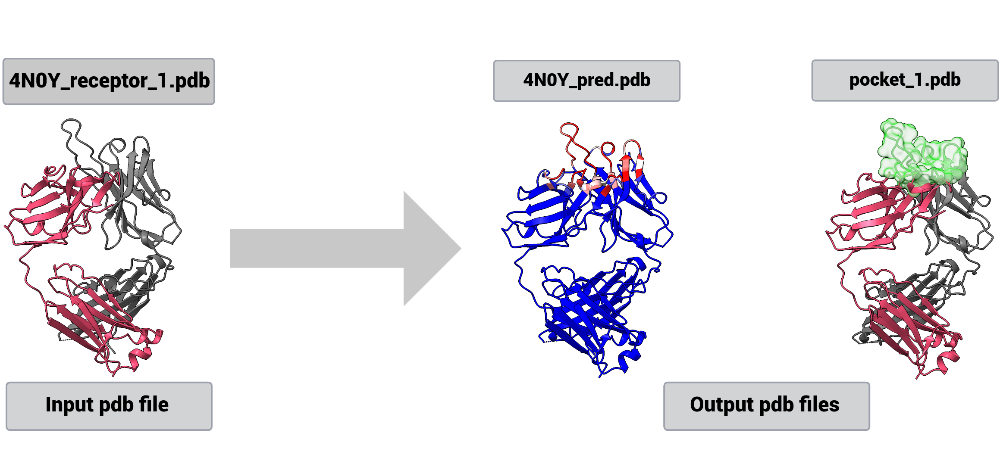

<p align="center">
  
</p>

# **ParaSurf**
## **[A Surface-Based Deep Learning Approach for Paratope-Antigen Interaction Prediction](https://doi.org/10.1093/bioinformatics/btaf062)**

ParaSurf is a state-of-the-art surface-based deep learning model for predicting interactions between antibodies and antigens, with outstanding results across three major antibody-antigen benchmarks.


[](https://github.com/aggelos-michael-papadopoulos/ParaSurf/blob/main/LICENSE)
[](https://doi.org/10.1093/bioinformatics/btaf062)
[](https://github.com/aggelos-michael-papadopoulos/ParaSurf/network/members)
[](https://github.com/aggelos-michael-papadopoulos/ParaSurf/stargazers)


---
🚀 **Try [ParaSurf](https://huggingface.co/spaces/angepapa/ParaSurf) on 🤗 Hugging Face now!!!**  
**Explore real-time predictions and visualize model outputs interactively!**

<p align="center">
  
</p>

**Note:** If you see *"This Space is sleeping due to inactivity"*, click "Restart this Space" and wait about 3 minutes for it to fully load.

---
### ParaSurf Integration in AI Startups:


**[ParaSurf is live on Superbio.ai!](https://app.superbio.ai/apps/67c5d70367f35115b8de2693)** – Try it out now!


**[ParaSurf is live on Neurosnap.ai!](https://neurosnap.ai/service/ParaSurf)** – Try it out now!


**[ParaSurf is live on tamarind.bio!](https://app.tamarind.bio/tools/parasurf)** – Try it out now!


**[ParaSurf is live on Vici.bio!](https://www.vici.bio/parasurf)** – Try it out now!


**[ParaSurf is live on proteinIQ.io!](https://proteiniq.io/app/parasurf)** – Try it out now!

 ---

**ParaSurf** Results on benchmark datasets:
* PECAN 
* Paragraph Expanded
* MIPE


## **ParaSurf Graphical Abstract**


## Installation

Setup the **Environment**
```bash
# Clone ParaSurf repository
git clone https://github.com/aggelos-michael-papadopoulos/ParaSurf.git 
conda create -n ParaSurf python=3.10 -y
conda activate ParaSurf
cd ParaSurf
pip install -r requirements.txt

# Install OpenBabel for chemical data processing
conda install -c conda-forge openbabel -y
```

Add ParaSurf to PYTHONPATH
```bash
nano ~/.bashrc  
export PYTHONPATH=$PYTHONPATH:/your/path/to/ParaSurf  # change the path to yours
source ~/.bashrc  
```
Install the **DMS software** for the surface molecular representation.
```bash
cd dms
sudo make install
cd ..
```

## 🐳 Docker installation
For detailed instructions on Docker Installation follow [ParaSurf Docker_Installation](Docker/README.md).
## **ParaSurf Model Weights**

All models are hosted [here](https://drive.google.com/drive/folders/1Kpehru9SnWsl7_Wq93WuI_o7f8wrPgpI?usp=drive_link).

Download the best model weights for each benchmark dataset below:


| Dataset                                              | Weights                                                                                                                                                      |
|------------------------------------------------------|--------------------------------------------------------------------------------------------------------------------------------------------------------------|
| PECAN Dataset                                        | [Download Best Weights](https://drive.google.com/uc?export=download&id=1vZGH-T6K5_ShVma3dwLkLdkoivs09rSP)                                                    |
| Paragraph Expanded                                   | [Download Best Weights](https://drive.google.com/uc?export=download&id=1nd3npYK303e8owDBvW8Ygd5m9SD1puhR)                                                    |
| Paragraph Expanded (Heavy Chains Only)               | [Download Best Weights](https://drive.google.com/uc?export=download&id=16LA99tPYP7vkKpc-ycn98esEUhXUDc-n)                                                    |
| Paragraph Expanded (Light Chains Only)               | [Download Best Weights](https://drive.google.com/uc?export=download&id=1mEBLPKi1sny-inr1ogdYWoo44XgbH8db)                                                    |
| MIPE Dataset (5-fold CV)                             | [best fold-1](https://drive.google.com/uc?export=download&id=1vIg9m557yiQdYsDelbR39Ch2QTKeLJp5), [best fold-2](https://drive.google.com/uc?export=download&id=1wU--r9sMxdF32nmdp3x9N1Ah8UriZVVD), [best fold-3](https://drive.google.com/uc?export=download&id=1LeATakZ-fxIaovQ8wydZbBNfSkbTsub7), [best fold-4](https://drive.google.com/uc?export=download&id=1dj482apCA09sBw2OUQrNR3PVBLEU9okp), [best fold-5](https://drive.google.com/uc?export=download&id=1Ai0VnytiUNUJsJ5ifKuBv4nkiz35iI6M) |


## **Blind antibody binding site prediction**
Run a blind prediction on a receptor file to identify binding sites:

```bash
python blind_predict.py --receptor test_blind_prediction/4N0Y_receptor_1.pdb --model_weights path/to/model_weights
```



## Create Datasets and train ParaSurf from scratch
Prepare the dataset from initial .csv files and create ParaSurf features for training.

### 1. Create dataset from the .csv files
For detailed instructions on preparing the dataset, see the [Dataset Preparation README](ParaSurf/create_datasets_from_csv/README.md).

### 2. Feature extraction
Follow instructions for feature extraction in the [ParaSurf Feature Extraction](ParaSurf/preprocess/README.md).

### 3. Train ParaSurf
Train and validate ParaSurf to reproduce the paper's results:
```bash
# Train ParaSurf model
python ParaSurf/train/train.py
```

## Reproduce ParaSurf Results
Once you have the best weights (downloaded or created from scratch), you can validate the model on the test sets and reproduce the results presented in the ParaSurf paper:

```bash
# Validate the ParaSurf model on the TEST set 
python ParaSurf/train/validation.py

# Reproduce ParaSurf results
python ParaSurf/train/Post_process_validation_resutls.py
```

# Contacts
For any issues or questions, please don't hesitate to reach out: [angepapa@iti.gr](mailto:angepapa@iti.gr)

# License

This project is licensed under the MIT License. See [LICENSE](LICENSE) file for details.


# 📍 Citation
If you use ParaSurf, please cite:
```bibtex
@article{papadopoulos2025parasurf,
  title={ParaSurf: A Surface-Based Deep Learning Approach for Paratope-Antigen Interaction Prediction},
  author={Papadopoulos, Angelos-Michael and Axenopoulos, Apostolos and Iatrou, Anastasia and Stamatopoulos, Kostas and Alvarez, Federico and Daras, Petros},
  journal={Bioinformatics},
  pages={btaf062},
  year={2025},
  publisher={Oxford University Press}
}
```
